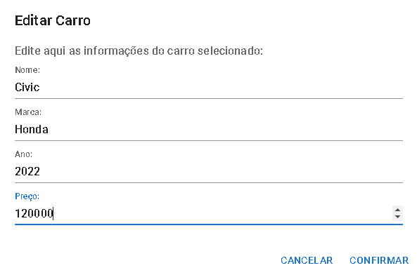
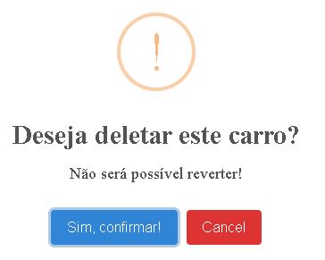
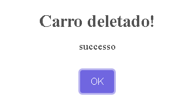

# Boas-vindas ao repositório do projeto BHUT Cars!

Este projeto tem como objetivo ser um CRUD para consumir [essa API](http://api-test.bhut.com.br:3000/api-docs/)

A versão online do projeto pode ser acessada atravéz deste [Deploy no Vercel](https://bhutcars.vercel.app/)

IMPORTANTE: Dependendo de seu navegador é necessário desativar a proteção da aba para conseguir vizualizar o deploy completamente,
tendo em vista que ele se alimenta de uma API HTTP.

Tecnologias usadas no projeto:

* HTML/CSS/JAVASCRIPT
* Vite
* React
* Material UI
* SweetAlert2

 <strong>CREATE</strong>
 

  

- [x] É possível criar um carro

- [x] Mensagem de notificação confirmando criação do carro

 <strong>READ</strong>
 

 

 - [x] Display de uma lista onde mostra as informações do carro.

 <strong>UPDATE</strong>
   

- [x] Opção de editar todas as informações do carro e atualizar na API ao clicar no ícone de edição.

- [x] Confirmação que a edição foi feita com sucesso.

<strong>DELETE</strong>
   

- [x] Opção de deletar o carro ao clicar no ícone de exclusão.

- [x] Confirmação que o carro foi deletado com sucesso.

